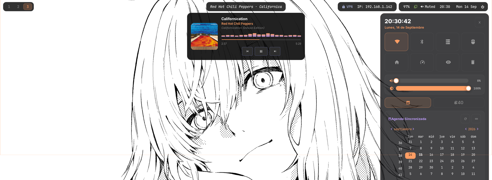

# TarArch

Mi Arch Linux con Hyprland, día a día, en un ASUS ROG con NVIDIA. Sin framework de dotfiles ni generador de plantillas. Es el primer proyecto que publico este verano; el segundo es [TaraTrack](https://github.com/Tara7ara/TaraTrack), mi tracker de series.

## Capturas




## Algunas cosas que costó sacar adelante

- **Los tooltips y popups salían invisibles** en Waybar y en el Centro de Control cuando el fondo llevaba `rgba()` con alpha < 1. Es un fallo de la mezcla de capas con NVIDIA en Wayland, no del CSS: con `rgb()` se ven bien, con cualquier transparencia no.
- **Los iconos de rofi nunca quedaban centrados.** Pango centra la caja lógica del glifo, no el dibujo, y los iconos de Nerd Font no son simétricos. Al final `make-rofi-icon.py` pasa cada icono a PNG, mide dónde está el dibujo con PIL y lo centra en un lienzo cuadrado.
- **`asusd` se peleaba con `rogauracore`** por el LED del teclado: ponías un color y al segundo volvía al anterior. Con `systemctl disable` no bastaba porque una regla udev del propio paquete lo volvía a arrancar en cada boot. Hace falta `mask`.
- **Cursor con 3 variantes** (`change-cursor.sh`, `Super+Alt+C`) que se aplica a la vez en Hyprland, en las variables de entorno y en GTK, para que cambie en todas las ventanas y no solo en la que tiene el foco.
- **Centro de Control propio** en GTK3 + GtkLayerShell, al estilo de Windows 11, con toggles, sliders y calendario. Quería que pareciera parte del sistema y no otra app suelta.
- La tarjeta de música (`media-card.py`) lleva un visualizador de CAVA dentro del popup, con la portada y las letras.

## Stack

Hyprland · Waybar · Rofi · Kitty · GTK3/GtkLayerShell (Python) · Bash · hyprlock/hypridle · systemd

## Estructura

```
config/       → ~/.config/*  (hypr, waybar, rofi, kitty, gtk, fastfetch...)
local/bin/    → ~/.local/bin/*  (scripts propios)
usr-local-bin/→ /usr/local/bin/*  (scripts que necesitan vivir fuera del home)
systemd/      → unidades de systemd (system, user, sleep hooks)
udev-rules/   → reglas udev
pacman-hooks/ → hooks de pacman
sysctl.d/     → /etc/sysctl.d/*
.zshrc, .zprofile
```

## Requisitos

No es un instalador de un clic, son mis configs para copiar y adaptar. Como mínimo:

`hyprland` `waybar` `rofi` `kitty` `hyprlock` `hypridle` `python-gobject` `gtk-layer-shell` `playerctl` `upower` `networkmanager` `cava`
