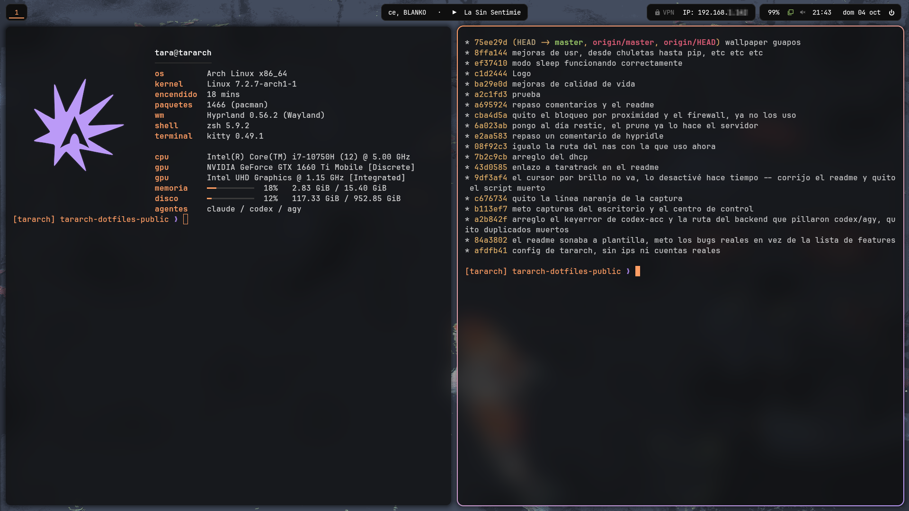
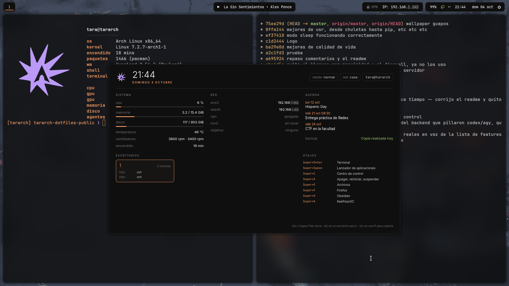
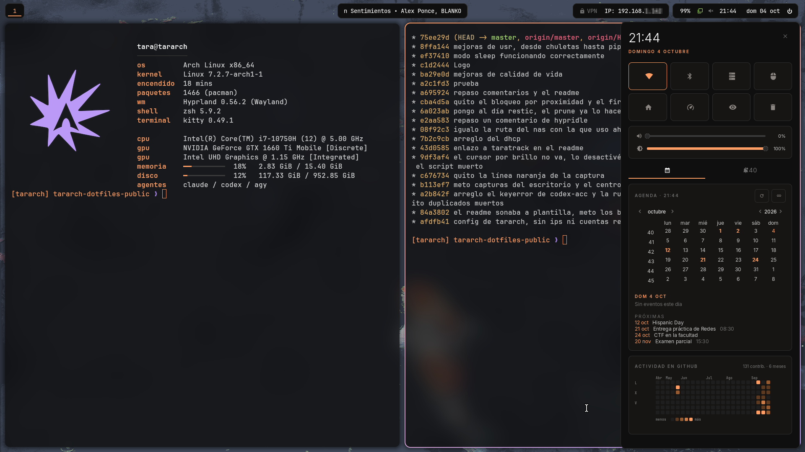
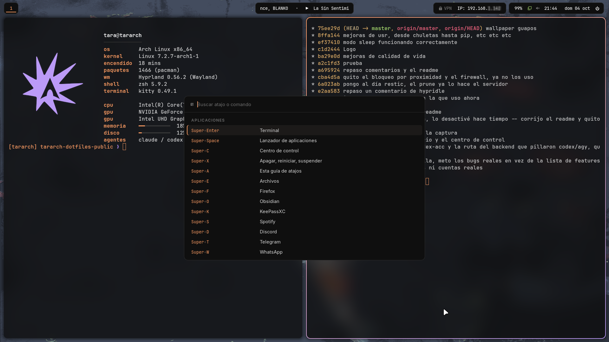
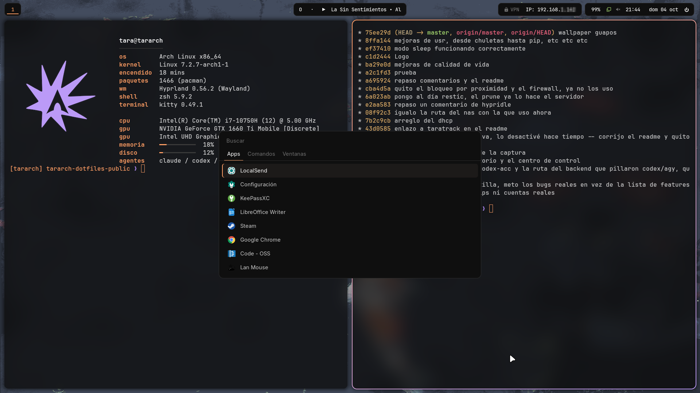
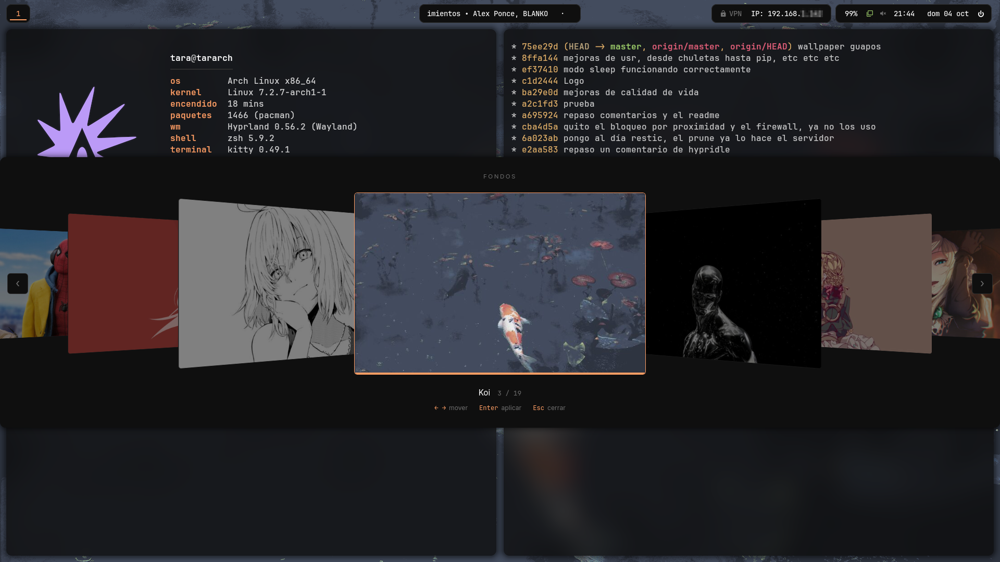
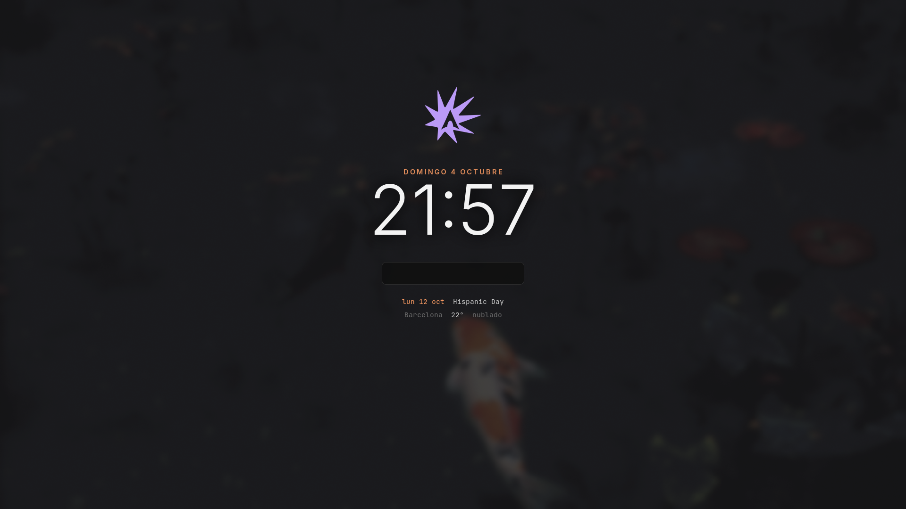

<p align="center"></p>

# TarArch

Mi Arch Linux con Hyprland, día a día, en un ASUS ROG con NVIDIA. Sin framework de dotfiles ni generador de plantillas. Es el primer proyecto que publico este verano; el segundo es [TaraTrack](https://github.com/Tara7ara/TaraTrack), mi tracker de series.

## Capturas



| | |
|---|---|
|  |  |
|  |  |





## Qué hay

La idea es que todo el viaje, de encender a escritorio, tenga la misma cara: fondo negro, grises cálidos, naranja para lo activo y nada de azul.

- **Arranque**: tema de GRUB (`grub/tararch/`) y splash de Plymouth (`plymouth/tararch/`) con el logo latiendo y la contraseña del disco cifrado en el mismo estilo.
- **Bloqueo** (`hyprlock`): fondo actual desenfocado, hora, próximo evento del calendario, el tiempo (Open-Meteo, sin clave; la ciudad se cambia arriba de `hyprlock-info.py`) y la canción que suena. Si aún no has elegido fondo, usa uno negro liso que viene en el repo.
- **Waybar** con islas opacas y el escritorio activo subrayado en naranja.
- **Panel de estado** (`tararch-dash`, `Super+Tab`): CPU, memoria, disco, temperatura, ventiladores, red, VPN, objetivo de pentest, agenda, backup y escritorios con sus ventanas (clic para ir).
- **Centro de Control** (`control-center.py`, `Super+C`): toggles, sliders, calendario y actividad de GitHub.
- **Menús de rofi** con el mismo estilo: lanzador, apagado, wifi, bluetooth, audio, brillo, SSH, modos del sistema... (`rofi-row.sh` monta las filas).
- **Guía de atajos** (`Super+A`), que sale del mismo listado que ejecuta los atajos (`keybindings-lib.sh`), así nunca se desfasa.
- **Menú de repos** (`repos`, `Super+Shift+G`) con la rama y si hay cambios o commits sin subir; Enter abre una terminal en el repo y Alt+Enter, lazygit flotante con la misma paleta.
- **Selector de fondos** en coverflow (`wallpaper-flow`, `Super+Izq/Der`, manteniendo Super para seguir pasando).
- **fastfetch** con el logo entrando girando en Kitty (`fastfetch-anim.py`) y barras de memoria y disco.
- Notificaciones (`swaync`), avisos de volumen y brillo (`swayosd`) y tarjeta de música con visualizador (`media-card.py`).

## Algunas cosas que costó sacar adelante

- **Los tooltips y popups salían invisibles** en Waybar y en el Centro de Control cuando el fondo llevaba `rgba()` con alpha < 1. Es un fallo de la mezcla de capas con NVIDIA en Wayland, no del CSS: con `rgb()` se ven bien, con cualquier transparencia no.
- **Los iconos de rofi nunca quedaban centrados.** Pango centra la caja lógica del glifo, no el dibujo, y los iconos de Nerd Font no son simétricos. Al final `make-rofi-icon.py` pasa cada icono a PNG, mide dónde está el dibujo con PIL y lo centra en un lienzo cuadrado.
- **`asusd` se peleaba con `rogauracore`** por el LED del teclado: ponías un color y al segundo volvía al anterior. Con `systemctl disable` no bastaba porque una regla udev del propio paquete lo volvía a arrancar en cada boot. Hace falta `mask`.
- **Cursor con 3 variantes** (`change-cursor.sh`, `Super+Alt+C`) que se aplica a la vez en Hyprland, en las variables de entorno y en GTK, para que cambie en todas las ventanas y no solo en la que tiene el foco.
- **Centro de Control propio** en GTK3 + GtkLayerShell, al estilo de Windows 11, con toggles, sliders y calendario. Quería que pareciera parte del sistema y no otra app suelta.
- **Splash de arranque con Plymouth** (`plymouth/tararch/`), con el logo latiendo y el prompt del disco cifrado a juego. Dos sustos: el hook `plymouth-encrypt` que piden casi todas las guías ya no existe en plymouth 26, y si lo pones `mkinitcpio` deja el initramfs sin hook de descifrado. Lo correcto es `plymouth` + `encrypt`. Y en un portátil híbrido el logo no salía: la pantalla interna va por la Intel, así que hay que meter `i915` en `MODULES` o plymouth se queda dibujando en una GPU sin salidas. El instalador ya hace las dos cosas y se para antes de regenerar nada.
- **El tema de GRUB no cargaba y no decía por qué.** Una propiedad de imagen vacía (`terminal-box: ""`) basta para que GRUB descarte el tema entero y vuelva al menú de texto. Y los mensajes de "Cargando Linux..." se veían con letras separadas porque la terminal de GRUB usaba Inter, que no es monoespaciada: necesita su propia fuente mono (`terminal-font`).
- **La ñ de "Contraseña" salía como un cuadrado** en Plymouth aunque el script esté en UTF-8, por la fuente que acaba dentro del initramfs. El texto va pre-renderizado en un PNG.
- **Las ventanas webview** (panel de estado, selector de fondos) no cogían las reglas de Hyprland: en Wayland la clase de la ventana es el `prgname` de GLib, no el `wmclass`.
- La tarjeta de música (`media-card.py`) lleva un visualizador de CAVA dentro del popup, con la portada y las letras.

## Stack

Hyprland · Waybar · Rofi · Kitty · GTK3/GtkLayerShell y WebKitGTK (Python) · Bash · hyprlock/hypridle · swaync · swayosd · Plymouth · GRUB · systemd

## Estructura

```
config/       → ~/.config/*  (hypr, waybar, rofi, kitty, gtk, fastfetch, swaync, lazygit...)
local/bin/    → ~/.local/bin/*  (scripts propios)
local/share/  → ~/.local/share/*  (lanzadores .desktop)
usr-local-bin/→ /usr/local/bin/*  (scripts que necesitan vivir fuera del home)
systemd/      → unidades de systemd (system, user, sleep hooks)
udev-rules/   → reglas udev
pacman-hooks/ → hooks de pacman
sysctl.d/     → /etc/sysctl.d/*
plymouth/     → tema del splash de arranque + instalador (GRUB + mkinitcpio)
grub/         → tema del menú de GRUB + instalador
.zshrc, .zprofile
screenshots/  → las capturas de arriba
```

## Requisitos

No es un instalador de un clic, son mis configs para copiar y adaptar. Lo de tu usuario va con `$HOME` o `~`, pero las unidades de `systemd/system/`, el hook de `systemd/sleep/` y los scripts de `usr-local-bin/` corren como root y llevan mi ruta escrita: cámbiala por la tuya. Como mínimo:

`hyprland` `waybar` `rofi` `kitty` `hyprlock` `hypridle` `python-gobject` `gtk-layer-shell` `playerctl` `upower` `networkmanager` `cava` `swaync` `swayosd`

Para el visor de imágenes (`imv-dir`): `imv` `inotify-tools`.

Para el panel de estado y el selector de fondos: `webkit2gtk-4.1` (y `awww` para poner el fondo).

Para abrir los repos en lazygit: `lazygit` (opcional; sin él, Alt+Enter abre la terminal).

Para la animación de fastfetch (el logo entra girando en Kitty): `python-pillow`.

Para el splash de arranque: `plymouth` (lo instala `sudo bash plymouth/tararch/install-plymouth.sh`).

> **Ojo con el splash.** El instalador toca el arranque (`/etc/mkinitcpio.conf`, `/etc/default/grub`, initramfs y `grub.cfg`), y si algo sale mal el equipo puede no arrancar o no pedir la contraseña del disco. Solo lo he probado en mi portátil: GRUB + mkinitcpio, disco cifrado con LUKS (`encrypt`), gráfica híbrida Intel + NVIDIA y plymouth 26. Con systemd-boot, `sd-encrypt`, dracut u otra distro no está probado. Hace backups y se para antes de regenerar nada, pero lee lo que imprime antes de darle a ENTER y ten un USB live a mano. Lo usas bajo tu responsabilidad.

Para el tema de GRUB: `sudo bash grub/tararch/install-grub-theme.sh`. Este es más tranquilo: solo añade `GRUB_THEME` a `/etc/default/grub` (con backup) y regenera `grub.cfg`, sin tocar las entradas del menú. Necesita que GRUB arranque en modo gráfico (no vale con `GRUB_TERMINAL_OUTPUT=console`); si algo falla, GRUB vuelve al menú de texto, no deja de arrancar. Las fuentes `.pf2` son Inter y JetBrains Mono convertidas con `grub-mkfont` (licencias OFL al lado).
